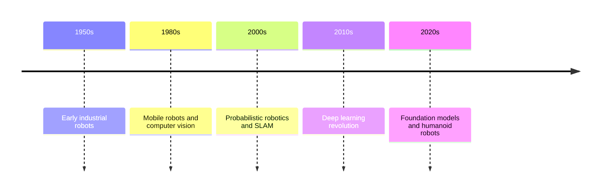

# Chapter 1: Introduction to Physical AI

## What is Physical AI?

Physical AI, also known as embodied AI, represents the convergence of artificial intelligence with physical systems that interact with the real world. Unlike traditional AI systems that operate purely in digital environments, Physical AI involves intelligent agents that perceive, reason about, and manipulate the physical world through sensors and actuators.

### Key Characteristics

Physical AI systems share several fundamental characteristics:

1. **Embodiment**: The AI is instantiated in a physical body (robot, drone, vehicle, etc.)
2. **Perception**: Uses sensors to gather information about the environment
3. **Action**: Can influence the physical world through actuators
4. **Real-time Processing**: Must respond to dynamic, unpredictable environments
5. **Grounding**: Knowledge is tied to physical experiences and interactions

## The Rise of Physical AI

The field of Physical AI has experienced remarkable growth in recent years, driven by advances in:

- **Deep Learning**: Enabling robust perception through computer vision and sensor fusion
- **Reinforcement Learning**: Allowing robots to learn complex behaviors through trial and error
- **Hardware**: Cheaper, more powerful computing and more capable actuators
- **Simulation**: Realistic physics engines for training before real-world deployment

### Historical Context

The journey from early automation to modern Physical AI:

## Why Physical AI Matters

Physical AI has the potential to transform numerous industries and aspects of human life:

### Manufacturing and Industry
- **Flexible automation**: Robots that adapt to new tasks without reprogramming
- **Collaborative robots (cobots)**: Safe human-robot interaction in shared workspaces
- **Quality inspection**: AI-powered visual inspection systems

### Healthcare
- **Surgical robots**: Precise, minimally invasive procedures
- **Rehabilitation robots**: Assistive devices for physical therapy
- **Elder care**: Robots to assist aging populations

### Transportation
- **Autonomous vehicles**: Self-driving cars, trucks, and delivery robots
- **Drones**: Aerial inspection, delivery, and surveillance
- **Warehouse automation**: Efficient goods movement and inventory management

### Exploration
- **Space robotics**: Rovers and landers for planetary exploration
- **Deep sea exploration**: Autonomous underwater vehicles
- **Disaster response**: Robots for search and rescue in hazardous environments

## Humanoid Robotics: The Ultimate Physical AI Challenge

Humanoid robots represent the pinnacle of Physical AI research for several reasons:

### 1. Human-Centric Design
Our world is designed for human morphology—stairs, doorknobs, vehicles, tools. A humanoid form factor allows robots to navigate and use existing infrastructure without modification.

### 2. Natural Interaction
Human-like appearance and movements facilitate intuitive communication and collaboration with people.

### 3. Versatility
Humanoid robots can potentially perform any task a human can, from delicate manipulation to dynamic locomotion.

### 4. Technical Complexity
Building a humanoid robot requires solving problems across multiple domains:
- **Bipedal locomotion**: Balance and walking on two legs
- **Dexterous manipulation**: Human-like hands with many degrees of freedom
- **Perception**: Multi-modal sensing (vision, touch, proprioception)
- **Cognition**: Task planning and decision-making
- **Energy efficiency**: Operating for extended periods

## The Current State of Humanoid Robotics

Recent years have seen remarkable progress in humanoid robotics:

### Leading Platforms

| Robot | Organization | Key Features |
|-------|-------------|--------------|
| Atlas | Boston Dynamics | Dynamic balance, parkour, backflips |
| Optimus | Tesla | General-purpose, mass production goal |
| ASIMO | Honda | Pioneering humanoid, now retired |
| NAO | Aldebaran | Education and research platform |
| Digit | Agility Robotics | Logistics and delivery focused |

### Recent Breakthroughs

- **Learning from video**: Training robots using human demonstration videos
- **Sim-to-real transfer**: Training in simulation, deploying to real robots
- **Foundation models**: Large language models for robot task planning
- **Whole-body control**: Coordinated movement of all joints

## Challenges Ahead

Despite progress, significant challenges remain:

### Technical Challenges
- **Energy density**: Batteries limit operation time
- **Reliability**: Robots still struggle with unpredictable environments
- **Cost**: High manufacturing and maintenance costs
- **Safety**: Ensuring safe operation around humans

### Algorithmic Challenges
- **Generalization**: Learning to handle novel situations
- **Common sense reasoning**: Understanding implicit physics and social rules
- **Long-term autonomy**: Operating independently for extended periods
- **Efficiency**: Learning with limited data and compute

### Societal Challenges
- **Ethics**: Responsible development and deployment
- **Job displacement**: Economic impacts of automation
- **Regulation**: Legal frameworks for robot operation
- **Privacy**: Data collection and surveillance concerns

## Learning Path

This textbook will guide you through the essential knowledge and skills to understand and build Physical AI systems, with a focus on humanoid robotics:

**Part 1 (Current)**: Foundations and historical context
**Part 2**: Robotics fundamentals—kinematics, dynamics, control
**Part 3**: Humanoid-specific topics—bipedal walking, manipulation
**Part 4**: AI techniques—perception, learning, planning
**Part 5**: Hands-on projects to apply your knowledge

## Summary

Physical AI represents a paradigm shift in artificial intelligence—moving from purely digital reasoning to systems that perceive and act in the physical world. Humanoid robotics, while technically challenging, offers the promise of general-purpose machines that can seamlessly integrate into human environments. As you progress through this textbook, you'll gain the theoretical foundations and practical skills to contribute to this exciting field.

## Key Takeaways

- Physical AI involves embodied agents that interact with the real world
- Humanoid robots are designed to work in human-centric environments
- Recent advances in AI and hardware have accelerated progress
- Significant technical, algorithmic, and societal challenges remain
- This field requires interdisciplinary knowledge spanning mechanics, electronics, and AI

## Further Reading

- Brooks, R. (1991). "Intelligence without representation"
- Dautenhahn, K. (2007). "Socially intelligent robots"
- Russell, S. & Norvig, P. (2021). "Artificial Intelligence: A Modern Approach" (Chapter on Robotics)

---

**Next**: [Chapter 2: Sensors and Perception](./chapter2-sensors.md)
